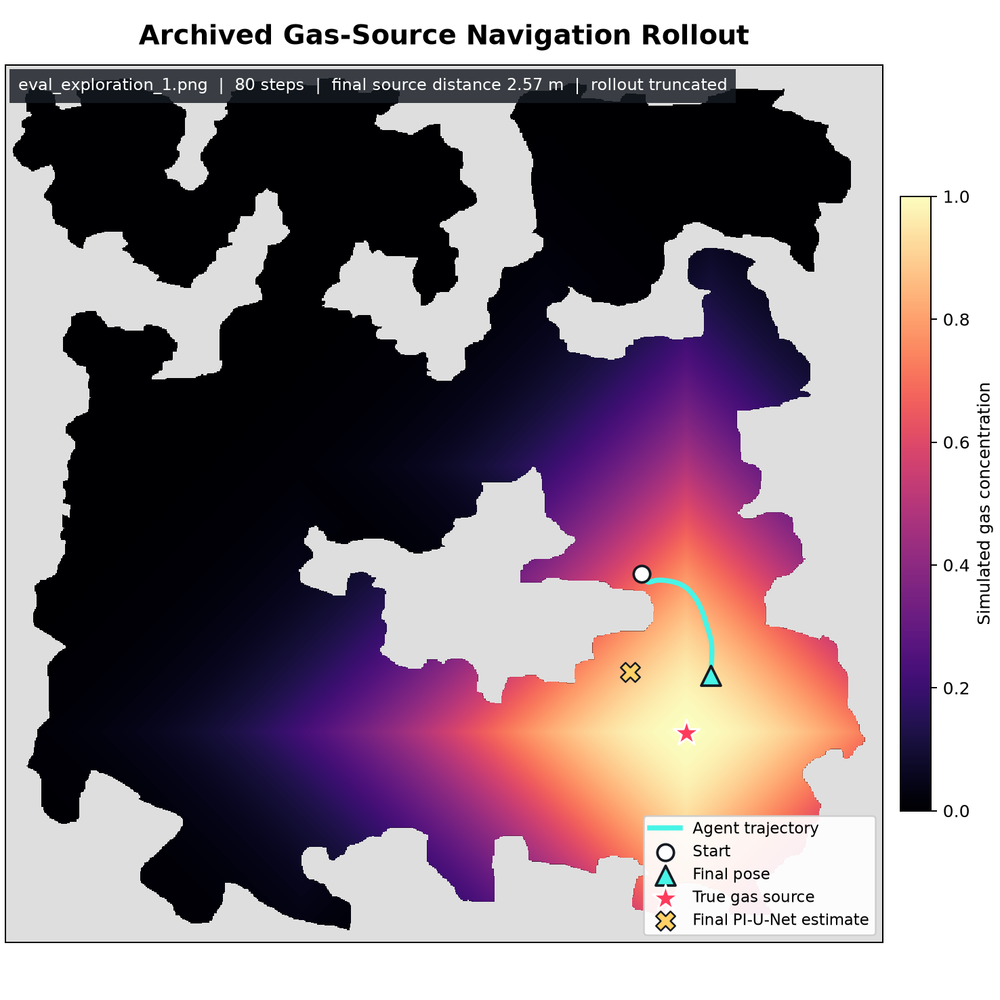
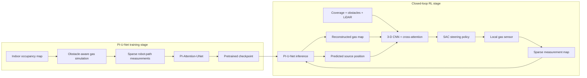

<div align="center">

# Physics-Informed Gas Source Navigation

### Reconstruct an indoor gas field from sparse mobile measurements — then let an RL agent find the source.

[](https://www.python.org/)
[](https://pytorch.org/)
[](https://gymnasium.farama.org/)
[](https://stable-baselines3.readthedocs.io/)
[](LICENSE)

**PI-Attention-UNet · obstacle-aware gas dispersion · sparse sensing · SAC · 3-D map fusion · cross-attention**

</div>

<p align="center">
  
</p>

<p align="center"><em>Archived 80-step evaluation preview: source distance decreased from 6.79 m to 2.57 m while measured concentration rose from 0.666 to 0.934. The background ground-truth field is shown only for interpretation and is not a policy input.</em></p>

## What is this?

This repository packages a two-stage research pipeline for indoor gas-source
localization:

1. A **Physics-Informed Attention U-Net** reconstructs a dense concentration
   field and predicts dispersion scale and source position from an obstacle map
   plus sparse gas measurements.
2. A **SAC navigation agent** consumes stacked, robot-relative coverage,
   obstacle, and reconstructed-gas maps together with LiDAR and the predicted
   source position to navigate toward the source.

The result is a single installable Python package with three command-line tools,
86 packaged maps, an example pretrained checkpoint, and a ready-to-share release
bundle.

## Highlights

| | Capability | What it adds |
|---|---|---|
| 🧭 | Obstacle-aware dispersion | Uses grid geodesic distance instead of straight-line distance, so walls and unreachable areas affect the synthetic gas field. |
| 🛰️ | Sparse mobile sensing | Reveals gas measurements only around the moving robot rather than exposing the full simulator field. |
| 🧠 | PI-Attention-UNet | Jointly predicts the dense gas field, normalized dispersion scale, and source position. |
| ⚙️ | Directional physics loss | Applies source-centered one-sided finite differences to encourage outward Gaussian decay. |
| 🤖 | Closed-loop RL | Runs PI-U-Net after each new sensor update and feeds the reconstruction back into the policy. |
| 🔀 | Modified policy architecture | Processes temporal multi-scale maps with a 3-D CNN and fuses LiDAR/source tokens through cross-attention. |
| 📦 | Distribution ready | Installs as `gas_source_navigation` and exposes training/evaluation CLI entry points. |

## Development lineage

The two similarly named working folders represented different stages of the
project:

```text
Original local rl-cpp workspace
└─ PI-U-Net data generation, training, and pretrained checkpoints
                         │
                         └── pi_attention_unet_indoor_gas_v1.pt
                                      │ transferred into
                                      ▼
Paper_main_pi_unet
└─ coverage-path environment foundation
   + sparse gas sensing
   + PI-U-Net inference at every step
   + gas-aware reward and termination
   + modified 3-D CNN / cross-attention policy
```

The public [`arvijj/rl-cpp`](https://github.com/arvijj/rl-cpp) project provided
the 2-D coverage environment foundation for the **second stage**. The PI-U-Net
training pipeline and checkpoint were developed first and then transferred into
that downstream RL environment.

## System overview



## Quick start

### 1. Install

```bash
python -m venv .venv

# Windows
.venv\Scripts\activate

# Linux / macOS
source .venv/bin/activate

python -m pip install --upgrade pip
python -m pip install -e ".[dev]"
```

For a cloned repository, fetch the public example checkpoint through Git LFS:

```bash
git lfs install
git lfs pull
```

### 2. Run a short RL smoke experiment

```bash
gsn-train-rl \
  --gas-model examples/weights/pi_attention_unet_indoor_gas_v1.pt \
  --gas-device cpu \
  --gas-inference-size 32 \
  --steps 1000 \
  --buffer-size 10000 \
  --output experiments/smoke
```

The reduced inference size is intended only for a quick integration check. Use
the original `320` inference size for research runs.

### 3. Train and evaluate

```bash
gsn-train-rl \
  --gas-model examples/weights/pi_attention_unet_indoor_gas_v1.pt \
  --gas-device cuda \
  --steps 1000000 \
  --output experiments/gas_sac

gsn-evaluate experiments/gas_sac/agent.zip \
  --gas-model examples/weights/pi_attention_unet_indoor_gas_v1.pt \
  --gas-device cuda \
  --episodes 10 \
  --render
```

The published PI-U-Net checkpoint removes the need to retrain the reconstruction
model before a GPU navigation run. Train or supply an SAC `agent.zip`, keep the
default full-resolution `320` inference size, and use `--render` to inspect the
rollout interactively.

## Public example checkpoint

The repository publishes one pretrained weight as an **example checkpoint** so
the reconstruction component can be loaded without retraining PI-U-Net from
scratch.

| File | Purpose | Size | SHA-256 |
|---|---|---:|---|
| [`pi_attention_unet_indoor_gas_v1.pt`](examples/weights/pi_attention_unet_indoor_gas_v1.pt) | PI-Attention-UNet example trained for dispersion scales in the 100–300 grid-cell range | 119.89 MiB | `AF145016…F38659A` |

The checkpoint is compatible with the model's sigmoid output head and the
`final_conv.0.*` state-dict layout used by the downstream RL experiments.

> This is a research example, not a production gas-detection model. It should
> not be used for safety-critical decisions without independent calibration and
> validation.

More metadata is available in
[`examples/weights/README.md`](examples/weights/README.md).

## Observation and policy architecture

The policy receives only reconstructed or locally sensed information; the true
simulator gas field is reserved for sensor generation, reward, and termination.

| Observation | Shape | Description |
|---|---:|---|
| `coverage` | `stacks × num_maps × H × W` | Robot-relative multi-scale visited-area maps |
| `obstacles` | `stacks × num_maps × H × W` | Robot-relative multi-scale obstacle maps |
| `gas` | `stacks × num_maps × H × W` | PI-U-Net reconstruction from accumulated sparse readings |
| `lidar` | `stacks × rays` | Normalized obstacle distances |
| `pred_pos` | `2` | PI-U-Net normalized source-position estimate |

The three map families are concatenated along the channel axis. A 3-D CNN learns
across spatial dimensions and temporal stack depth. Its map embedding becomes a
query that attends to projected LiDAR and source-position tokens before the
final SAC feature projection.

The gas-aware reward combines:

- measured concentration;
- normalized distance to the simulated source;
- newly covered area and optional overlap penalty;
- constant step cost and collision penalty;
- a terminal source-reaching bonus above the concentration threshold.

The environment also reduces its time step near high concentrations for finer
local motion.

## Train the PI-Attention-UNet

The dataset adapter expects a pickle dictionary containing:

- `obstacle_maps`
- `masked_maps`
- `true_gas_maps`
- `sigma_true`
- `position_true`

```bash
gsn-train-unet path/to/preprocessed_dataset.pkl \
  --output experiments/pi_unet.pt \
  --epochs 400 \
  --batch-size 24 \
  --physics-weight 1.0
```

To reproduce the notebook variant that monitors reconstruction MSE but excludes
it from the optimized objective:

```bash
gsn-train-unet path/to/preprocessed_dataset.pkl --no-data-loss
```

## Python API

```python
from gas_source_navigation import GasMapPredictor, MowerEnv

predictor = GasMapPredictor(
    "examples/weights/pi_attention_unet_indoor_gas_v1.pt",
    device="auto",
    inference_size=320,
)

env = MowerEnv(gas_predictor=predictor)
observation, info = env.reset(seed=42)
observation, reward, terminated, truncated, info = env.step([0.0])
env.close()
```

## Command-line tools

| Command | Purpose |
|---|---|
| `gsn-train-unet` | Train the Physics-Informed Attention U-Net |
| `gsn-train-rl` | Train the SAC gas-source navigation agent |
| `gsn-evaluate` | Evaluate a trained navigation checkpoint |

Run any command with `--help` for its complete option list.

## Repository layout

```text
src/gas_source_navigation/
├─ gas/                  PI-U-Net, losses, dispersion, data, inference
├─ rl/                   navigation environment and policy architecture
├─ cli/                  installed command-line entry points
└─ assets/maps/          86 packaged training/evaluation maps
examples/weights/        public example checkpoint and metadata
docs/images/             README research visuals
tests/                   model, physics, environment, and architecture tests
archive/                 ignored local research history and large raw datasets
dist/                    ignored generated wheel and release bundle
```

## Build and publish

Build an installable wheel:

```bash
python -m pip wheel --no-cache-dir --no-deps --no-build-isolation . --wheel-dir dist
```

The generated wheel contains the Python package, all three CLI tools, and the 86
default maps. The public example checkpoint is distributed through Git LFS and
is also included in the generated release bundle:

```text
dist/gas_source_navigation-0.1.0-windows.zip
```

Recommended GitHub publication flow:

1. Push the source repository with Git LFS enabled for `examples/weights/*.pt`.
2. Attach the generated ZIP to a GitHub Release for users who want a wheel and
   checkpoint in one download.
3. Keep raw datasets, notebooks, and experiment logs under `archive/`; they are
   intentionally excluded from the public package.

## Verification

```bash
python -m ruff check .
python -m pytest -q
```

The maintained test suite covers:

- obstacle-aware geodesic gas dispersion;
- checkpoint-compatible PI-Attention-UNet outputs;
- directional finite differences and differentiable physics loss;
- Gymnasium observation/action contracts;
- stacked-map 3-D CNN and cross-attention output shape.

## Attribution

The downstream RL environment was built on the public implementation of
[Learning Coverage Paths in Unknown Environments with Deep Reinforcement
Learning](https://arxiv.org/abs/2306.16978), available at
[`arvijj/rl-cpp`](https://github.com/arvijj/rl-cpp).

That upstream project supplied the coverage simulation, map handling, and
Stable-Baselines3 training foundation. The indoor gas simulation, sparse sensing
pipeline, PI-Attention-UNet workflow, source-centered physics loss, gas-aware RL
task, and modified 3-D CNN/cross-attention policy are project-specific additions.

## License

This repository retains the original Clear BSD licensing terms. See
[`LICENSE`](LICENSE).
